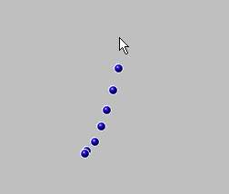



## Animated Mouse Tail \(Rev1\)

### Description

This is a demo of animated mouse's tail. The mouse tail with spring, gravity, resistance and other properties will follow the mouse pointer. When they hit the screen's boundaries, they will bounce and swing.

The current version didnt exploit most of the possible features because this is just too fun

to play with and i cant wait to share with you all. Tell me how you like it.

The original source code is in JavaScript by Philip Winston (pwinston@yahoo.com).

Msg on 23/09/2000

Revision 1:

Draw balls using bitblt (in the way i can only figure for the time being).

i will let you judge the performance. the drawback is a additional

routine to make the background of balls transparant will be needed. (not implemented here)

Msg on 24/09/2000
 
### More Info
 

             |
---                |---
**Submitted On**   |2000-09-24 01:44:10
**By**             |[chun meng](https://github.com/Planet-Source-Code/PSCIndex/blob/master/ByAuthor/chun-meng.md)
**Level**          |Intermediate
**User Rating**    |4.8 (29 globes from 6 users)
**Compatibility**  |VB 5\.0, VB 6\.0
**Category**       |[Games](https://github.com/Planet-Source-Code/PSCIndex/blob/master/ByCategory/games__1-38.md)
**World**          |[Visual Basic](https://github.com/Planet-Source-Code/PSCIndex/blob/master/ByWorld/visual-basic.md)
**Archive File**   |[CODE\_UPLOAD101049232000\.zip](https://github.com/Planet-Source-Code/chun-meng-animated-mouse-tail-rev1__1-11610/archive/master.zip)

